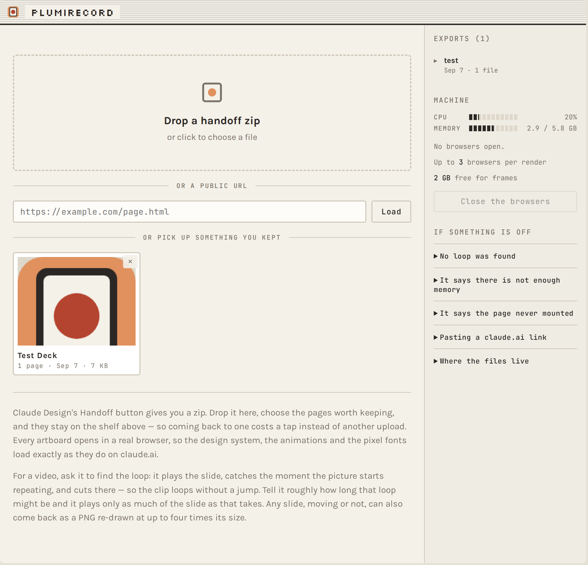

# PlumiRecord

Turn an animated [Claude Design](https://claude.ai) page — or any HTML you have — into a
social-ready mp4.

Claude will happily design you an animated slide. Getting a *video* of it out is the
hard part: the built-in export is unreliable, and screen-recording it gives you your
compositor's frame rate, your monitor's colour profile and your window's dimensions
rather than the ones the design asks for. PlumiRecord drives a headless browser
directly, so the clip is the size the artboard is, at the frame rate you asked for,
in the colours the design was drawn in.

It runs as a **drop-a-file web app** or a **command line tool**, on **macOS, Linux and
Windows**, with **no npm dependencies**.



[](https://github.com/THRAUR/PlumiRecord/actions/workflows/ci.yml)

---

## Getting started

You need three things. Two of them you probably already have.

| | |
|---|---|
| **Node 22+** | [nodejs.org](https://nodejs.org). Version 22 or newer — that is where Node's built-in WebSocket arrived, and PlumiRecord talks to the browser over one. |
| **A Chrome** | Google Chrome, Chromium, Brave or Edge — whichever you already use is fine. See [below](#a-leaner-browser) for the leaner option. |
| **ffmpeg** | `brew install ffmpeg` · `sudo apt install ffmpeg` · `winget install Gyan.FFmpeg` |

Then:

```bash
git clone https://github.com/THRAUR/PlumiRecord.git
cd PlumiRecord
node bin/plumirecord.mjs --doctor
```

`--doctor` tells you what it found and what is missing, before you spend two minutes
on a render that was going to fail at the last step:

```
PlumiRecord on darwin/arm64, Node v22.14.0

 ok   node      v22+, has WebSocket
 ok   chrome    /Applications/Google Chrome.app/Contents/MacOS/Google Chrome  (full browser — headless shell would be leaner)
 ok   ffmpeg    ffmpeg

workers   4 (7 cores usable, 18.4GB free)
data      /Users/you/Library/Application Support/PlumiRecord
browsers  0 of ours running

Ready.
```

To have `plumirecord` and `plumirecord-server` on your PATH: `npm install -g .`

## The app

```bash
npm start          # then open http://localhost:3005
```

Claude Design's **Handoff** button gives you a zip. Drop it on the page, pick the
slides worth keeping, and choose an artboard — it opens in a real browser, so the
design system, the animations and the webfonts all load exactly as they do on
claude.ai. Then ask for a video or a still.

Uploads you keep stay on a shelf, so coming back to a deck next week costs a tap
rather than another upload. Renders land in a library you can download or, on a
phone, share straight into an app.

It listens on `127.0.0.1` — your machine only. See [Running it on a box](#running-it-on-a-box)
before you change that.

## The command line

```bash
# Find out what artboards a page has
plumirecord slide.dc.html --probe
#   #tutTile                     1080x1350  Tutorial
#   animations: bob, blink, sweep

# Record one, letting it work out how long the loop is
plumirecord slide.dc.html --tile '#tutTile'

# 4K-ish, at a frame rate a compositor cannot deliver
plumirecord slide.dc.html --tile '#tutTile' --scale 2 --fps 60 --duration 8

# A still of the same slide, re-drawn at three times its size
plumirecord slide.dc.html --tile '#tutTile' --png --scale 3 --start 2
```

<details>
<summary>Every option</summary>

| Option | What it does |
|---|---|
| `--tile <selector>` | Record only this element, sized to its own box. |
| `--duration <sec>` | Length of the clip. Omit it to auto-detect the loop. |
| `--start <sec>` | Drop this many seconds from the mount, to skip a one-shot intro. |
| `--fps <n>` | Frame rate (default 30). |
| `--scale <n>` | Render at n times size — 2 turns a 1080×1350 slide into 2160×2700, re-rendered rather than upscaled. |
| `--stepped` | Step the page's clock instead of recording in real time. Implied by `--scale` or `--fps` above 60. |
| `--realtime` | Force real-time capture even when stepping is implied. |
| `--workers <n>` | Browsers to split a stepped render across. Defaults to what the machine can hold. |
| `--size <WxH>` | Override the capture size. |
| `--out <path>` | Output file. |
| `--png` | Save the opening frame as a PNG instead of a video. |
| `--probe` | List the page's artboards with their sizes, then exit. |
| `--detect` | Report the detected loop length and start, then exit. |
| `--no-audio` | Skip the silent audio track. Some Instagram upload paths reject a video with no audio stream, so it is on by default. |
| `--offline` | Block external DNS. Self-contained bundles only. |
| `--doctor` | Check this machine has what the tool needs. |
| `--keep-frames` | Leave the extracted PNG frames behind. |

</details>

It is also importable, if you would rather script it:

```js
import { probe, detectLoop, record, snap } from 'plumirecord';

const { loop, start } = await detectLoop('slide.html', { tile: '#tile' });
await record('slide.html', { tile: '#tile', duration: loop, start, scale: 2, out: 'clip.mp4' });
```

---

## What it does that a screen recorder doesn't

**It finds the loop.** Ask for a video without saying how long, and it plays the
slide under a frozen clock, reduces every frame to a small grey thumbnail, and looks
for the shortest interval after which the picture repeats. The cut lands exactly on
the period, so the clip loops without a visible jump. It scores the *worst* cell of
the frame rather than the average, because a slide can replay its animation
perfectly while the text inside it moves on — averaged over a whole frame that text
is a rounding error, and you get a clean-looking number for a clip that visibly jumps.

**Resolution and frame rate stop being constraints.** Real-time capture is capped by
the compositor's 60Hz and starts dropping frames as the picture grows. So above
1080p or 60fps it stops watching the clock and starts *driving* it: `setTimeout`,
`requestAnimationFrame`, `Date.now` and every running CSS animation are replaced with
a shim that advances one frame at a time and screenshots each position. Every frame
is exact, and a 2160×2700 60fps clip is just a slower render rather than an
impossible one.

**It records the artboard, not the window.** A design page is a wall of artboards.
Point it at one with `--tile` and the clip is that element's own box — 1080×1350, or
whatever the design says — with no cropping and no scaling.

**The colours match the still.** A video and a PNG of the same slide sit next to each
other in a carousel, and a swipe between them shows any step. Getting them to agree
took measuring: full range rather than ffmpeg's default squeeze into 16–235, zimg
rather than swscale for the RGB→YUV conversion where your ffmpeg has it (0.56 against
1.17 levels of mean error — it falls back cleanly when it does not, which Homebrew's
build does not), and — the one that is actually visible on a phone — tagging the
transfer as `iec61966-2-1` (sRGB) rather than `bt709`. Browser frames *are* sRGB; asking a colour-managed viewer to decode them on
bt709's curve lands the clip 6–16 levels off the still beside it while every value in
the file is "correct".

**It knows what it can afford.** A render is costed before it starts — memory for the
browsers, memory for the encoder, disk for the frames — and refused with a readable
explanation if the machine cannot hold it. Renders are capped to leave a core free,
and the encode is pinned to that budget too. Browsers left behind by a cancelled or
crashed run are swept, matched on the profile directory they were given rather than
on being called "chrome", so tidying up can never close the tabs you were working in.

---

## Running it on a box

The web app has no login. By default it binds to `127.0.0.1`, which is why that is
safe. If you want to reach it from your phone, put it behind something that
authenticates — a VPN like [Tailscale](https://tailscale.com), or a reverse proxy —
and then:

```bash
plumirecord-server --host 0.0.0.0 --port 3005
```

Under a process manager, for example PM2:

```js
{ name: 'plumirecord', cwd: '/srv/PlumiRecord', script: 'bin/plumirecord-server.mjs',
  env: { PORT: 3005, PLUMIRECORD_HOST: '0.0.0.0' } }
```

| Variable | |
|---|---|
| `PORT` | Port to listen on (default 3005). |
| `PLUMIRECORD_HOST` | Address to bind (default `127.0.0.1`). Deliberately not `$HOST` — that is already set to `0.0.0.0` in plenty of shells for the benefit of some other program, and publishing yourself to the network because of a variable nobody aimed at you is an accident, not a default. |
| `PLUMIRECORD_DATA` | Where uploads and renders are kept. Defaults to your platform's app-data directory. |
| `PLUMIRECORD_CHROME` | Use this browser binary. |
| `PLUMIRECORD_FFMPEG` | Use this ffmpeg binary. |

### A leaner browser

`chrome-headless-shell` is the rendering half of Chrome without the browser around
it: it starts faster and holds a few hundred megabytes less, which matters when a
stepped render runs four of them at once. If you have it, PlumiRecord prefers it
automatically.

```bash
npx playwright install chromium-headless-shell
```

---

## If something is off

**"the page never mounted"** — a raw `.dc.html` loads React from a CDN, so it needs
network access. Drop `--offline`.

**A `claude.ai` link will not load.** Those pages need your login. Use the handoff
zip, or a public URL.

**"no loop found"** — nothing on the page repeats within the search window. Pass
`--duration` and pick the length yourself.

**A render is refused for memory.** That is the check working: `--scale 2` on a
1080×1350 slide asks for four times the pixels, and the encoder's buffers scale with
frame size, not clip length. Use a smaller scale, or free some memory.

**Nothing looks right and you want a clean slate.** "Close the browsers" in the app,
or `plumirecord --doctor` to see how many are still resident.

## How it is put together

```
bin/       the two commands
src/
  recorder.mjs   CDP session, the clock shim, loop detection, ffmpeg encoding
  server.mjs     the web app: uploads, the shelf, jobs, progress over SSE
  platform.mjs   everything that differs between macOS, Linux and Windows
  unzip.mjs      a dependency-free zip reader
public/    the app's front end — one HTML file, no build step
test/      unit tests, plus an end-to-end render CI runs on all three platforms
```

`npm test` runs the lot. The render tests skip themselves if Chrome or ffmpeg is
missing rather than failing, since that is a missing dependency and not a broken
build.

## Licence

MIT — see [LICENSE](LICENSE). Do what you like with it.

PlumiRecord grew out of [PlumiBot](https://www.plumibot.com), where it turns design
slides into social posts.
